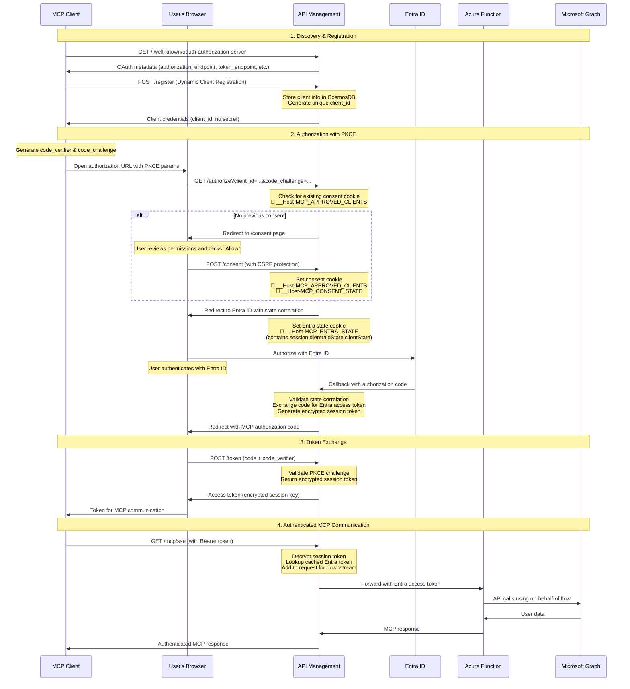
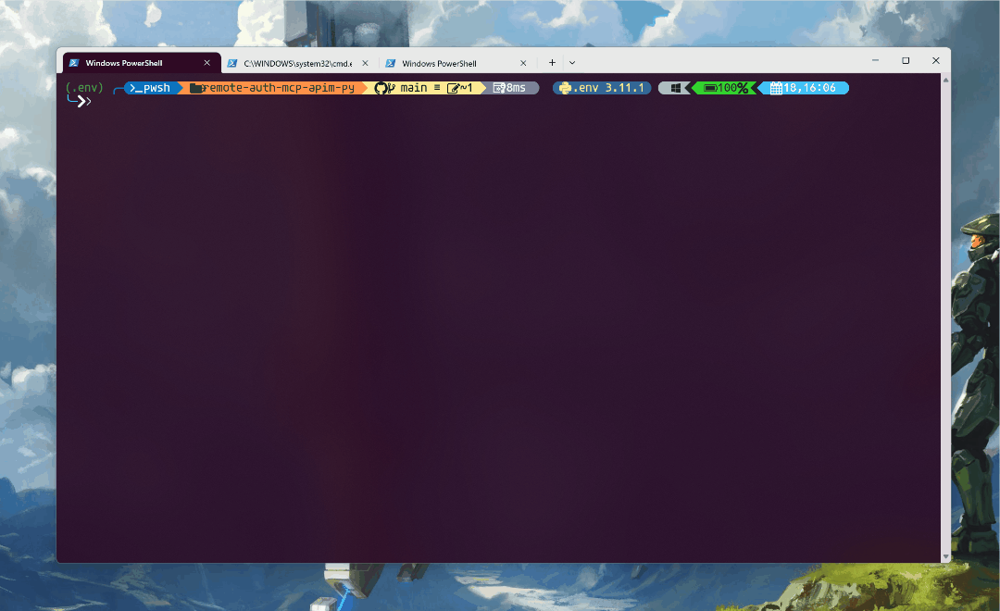
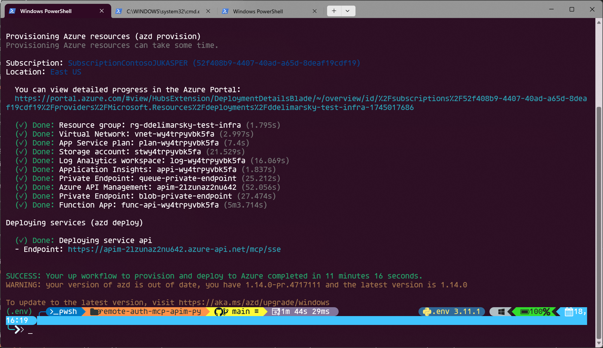
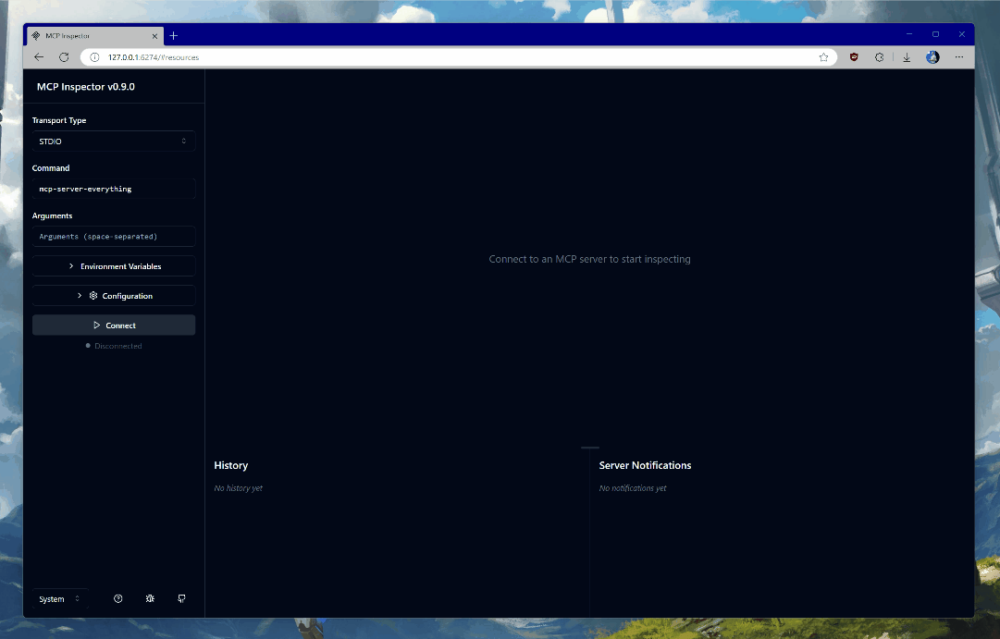
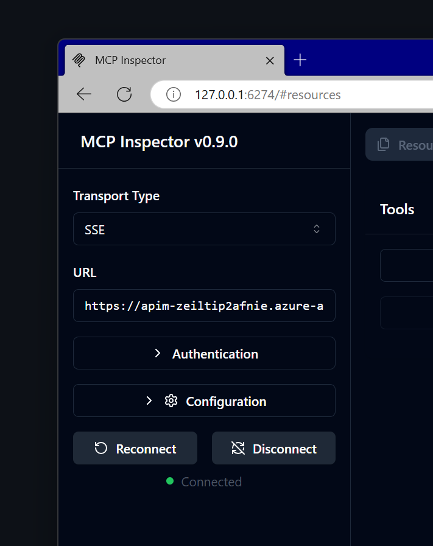
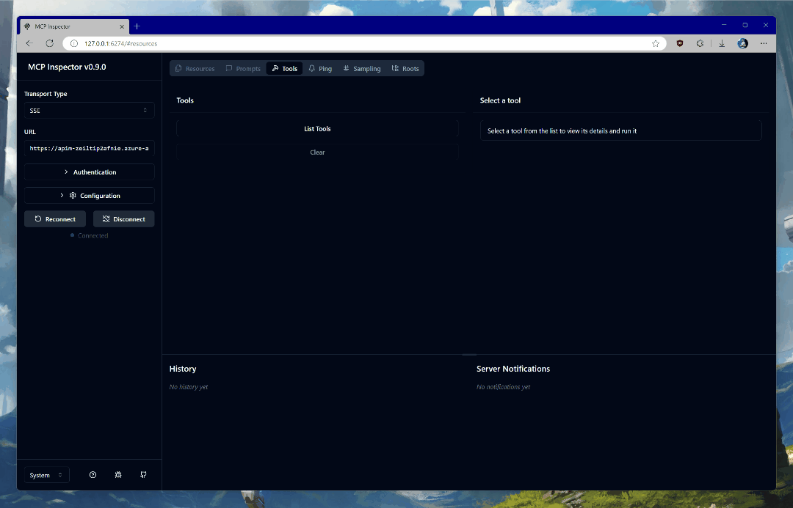

# 🤫 Authenticated Remote MCP Server

This sample shows how to deploy an Entra ID-protected MCP server on Azure.

The sample also uses an authorization pattern where the client acquires a token _for the MCP server_ first, and then uses [on-behalf-of flow](https://learn.microsoft.com/entra/identity-platform/v2-oauth2-on-behalf-of-flow) to exchange it for a token that can be used with [Microsoft Graph](https://learn.microsoft.com/graph/overview). It does all this in an entirely secretless manner too.

## ⚠️ Important: Experimental Implementation

>[!IMPORTANT]
> **This is an experimental implementation and should NOT be used in production scenarios.** 
> 
> This sample demonstrates how to build a protected MCP server with Entra ID by implementing OAuth 2.0 Dynamic Client Registration and PKCE flow patterns that work around current gaps in Entra ID's native support for these standards. While it showcases the technical possibilities, it's intended for educational and proof-of-concept purposes only.
> 
> For production scenarios, consider using established authentication patterns with pre-registered applications and standard OAuth flows.

## What it uses

- ⚡ [Azure Functions](https://learn.microsoft.com/azure/azure-functions/functions-overview)
- 🕸️ [Azure API Management](https://learn.microsoft.com/azure/api-management/api-management-key-concepts)
- 💪 [Bicep](https://learn.microsoft.com/azure/azure-resource-manager/bicep/)
- 🐍 [Python](https://www.python.org/)
- 🚀 [Azure Developer CLI](https://learn.microsoft.com/azure/developer/azure-developer-cli/install-azd?tabs=winget-windows%2Cbrew-mac%2Cscript-linux&pivots=os-windows)

>[!NOTE]
>You can use the [Model Context Protocol Inspector](https://modelcontextprotocol.io/docs/tools/inspector) or [Visual Studio Code](https://code.visualstudio.com) to test this MCP server.

## How the Authorization Flow Works

This implementation uses a sophisticated OAuth 2.0 flow with PKCE (Proof Key for Code Exchange) to securely authenticate MCP clients. Here's how it all fits together:



### Security Features & Cookies Used

This implementation uses several security mechanisms and cookies to ensure a secure flow:

| Cookie | Purpose | Security Features |
|--------|---------|-------------------|
| `__Host-MCP_APPROVED_CLIENTS` | Remembers user consent for specific clients | `__Host-` prefix, Secure, HttpOnly, SameSite=Lax |
| `__Host-MCP_DENIED_CLIENTS` | Remembers denied consent to prevent re-prompting | `__Host-` prefix, Secure, HttpOnly, SameSite=Lax |
| `__Host-MCP_CONSENT_STATE` | Validates consent form submissions | `__Host-` prefix, Secure, HttpOnly, SameSite=Lax |
| `__Host-MCP_ENTRA_STATE` | Correlates Entra ID callback with original request | `__Host-` prefix, Secure, HttpOnly, SameSite=None |
| `__Host-MCP_CSRF_TOKEN` | Protects against CSRF attacks on consent forms | `__Host-` prefix, Secure, HttpOnly, SameSite=Lax |

**Key Security Features:**

- 🔐 **PKCE (Proof Key for Code Exchange)** - Prevents authorization code interception
- 🍪 **Secure Cookies** - All cookies use `__Host-` prefix for maximum security
- 🛡️ **CSRF Protection** - Double-submit cookie pattern with constant-time validation
- 🔄 **State Correlation** - Multiple layers of state validation prevent session fixation
- 🔒 **Encrypted Session Tokens** - Session identifiers are AES-encrypted
- ⏰ **Token Caching** - Entra tokens cached with encrypted session keys for performance

## Getting started

Follow these steps to get started.

1. [Install the Azure Developer CLI](https://learn.microsoft.com/azure/developer/azure-developer-cli/install-azd).

2. Clone the repository locally:

    ```bash
    git clone https://github.com/localden/remote-auth-mcp-apim-py
    ```

3. Navigate to the repository in your terminal:

    ```bash
    cd remote-auth-mcp-apim-py
    ```

4. Ensure the `Microsoft.App` resource provider is registered on your subscription either on the [Azure portal](https://learn.microsoft.com/azure/azure-resource-manager/management/resource-providers-and-types#azure-portal) or by running the following [Azure CLI command](https://learn.microsoft.com/cli/azure/install-azure-cli?view=azure-cli-latest):

    ```bash
    az login
    az provider register --namespace Microsoft.App --wait
    ```

5. Log in to Azure Developer CLI:

    ```bash
    azd auth login
    ```

6. Deploy the project to Azure:

    ```bash
    azd up
    ```

>[!IMPORTANT]
>Deploying this project will incur Azure cost. If you are deploying for testing and experimentation, make sure to delete the created resource group after testing.

## Deploying and testing the project

When you run `azd up`, resources declared in the [`infra`](https://github.com/localden/remote-auth-mcp-apim-py/tree/main/infra) directory will be provisioned in your Azure account. You can go through the existing Bicep files to see what infrastructure will be automatically deployed.



Once the deployment completes, you will be see the **endpoint** printed in the terminal:



For example, in the screenshot above the endpoint is `https://apim-2lzunaz2nu642.azure-api.net/mcp/sse`. Copy it.

>[!NOTE]
>Prior to the next step, make sure that you have [Node.js](https://nodejs.org/en) installed - it's required to run the [Model Context Protocol Inspector](https://modelcontextprotocol.io/docs/tools/inspector).

In your terminal, run:

```bash
npx @modelcontextprotocol/inspector@0.9.0
```

>[!NOTE]
>We're using the `0.9.0` release of the Model Context Protocol Inspector because it's the most stable version when it comes to testing protected MCP servers.

This will give an endpoint where you can see Model Context Protocol Inspector running locally. Open the URL in your browser.

Switch the **Transport Type** to **SSE** and set the **URL** to the endpoint that you got from running the deployment. Click **Connect**.



You will be prompted to authenticate with the credentials **in the tenant in which you deployed the infrastructure**. The Entra ID applications are dynamically registered at deployment time - one for the server, and another that will be used for [on-behalf-of flow](https://learn.microsoft.com/entra/identity-platform/v2-oauth2-on-behalf-of-flow) to acquire [Microsoft Graph](https://learn.microsoft.com/graph/use-the-api) access.

Once you consent, you will be returned back to the Model Context Protocol Inspector landing page. Wait a few seconds until the connection is established - you will see a green **Connected** label on the page.



Once connected, click on **List Tools** and select `get_graph_user_details`. This will enable you to get data about the currently authenticated user from Microsoft Graph. Click **Run Tool**.



If all goes well, you will see your user data in the response block, like this:

```json
{
  "@odata.context": "https://graph.microsoft.com/v1.0/$metadata#users/$entity",
  "businessPhones": [],
  "displayName": "YOUR_NAME",
  "givenName": null,
  "jobTitle": null,
  "mail": "YOUR_EMAIL",
  "mobilePhone": null,
  "officeLocation": null,
  "preferredLanguage": null,
  "surname": null,
  "userPrincipalName": "YOUR_UPN",
  "id": "c6b77314-c0ec-44b2-b0bb-2c971a753f0c",
  "success": true
}
```

## Feedback and reporting issues

Make sure to [open an issue](https://github.com/localden/remote-auth-mcp-apim-py/issues) if you encounter any roadblocks or have comments.
